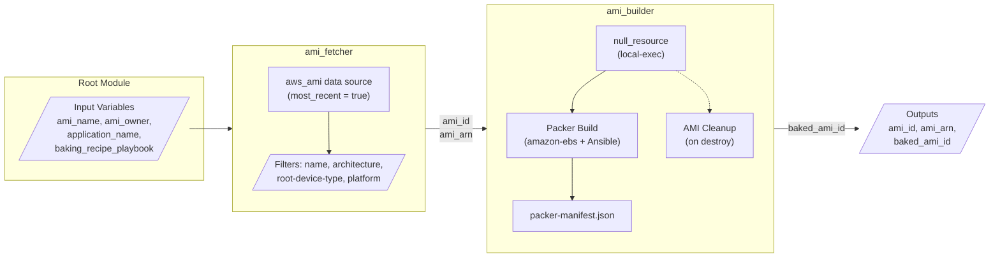
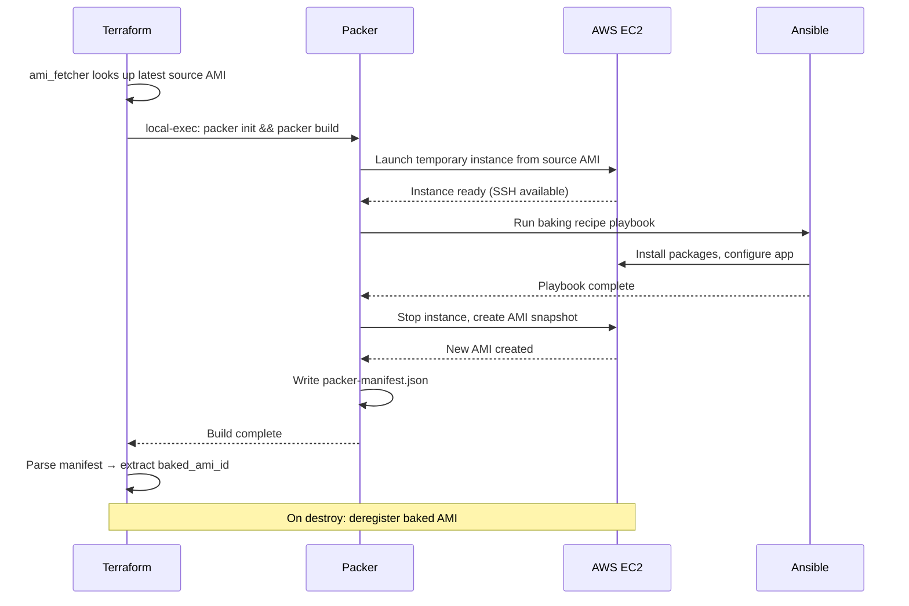
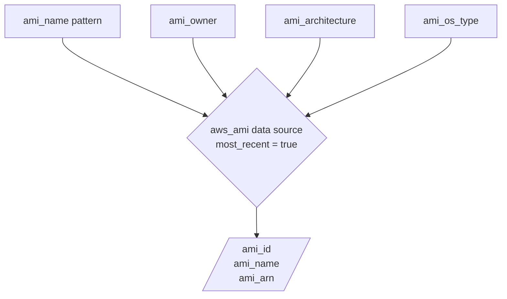
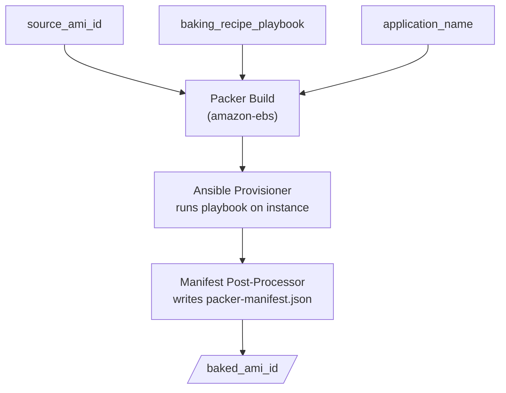
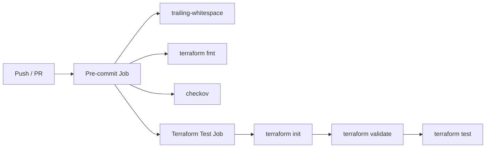

# bk-bake-ami-module

Terraform module for **fetching** and **baking** Amazon Machine Images (AMIs) in the BakeFoundry ecosystem. It fetches the latest matching source AMI from AWS and bakes a new AMI using HashiCorp Packer with an Ansible playbook.

---

## Architecture



---

## AMI Baking Flow



---

## Repository Structure

```
bk-bake-ami-module/
├── main.tf                              # Root module — wires ami_fetcher → ami_builder
├── variables.tf                         # Root input variables
├── outputs.tf                           # Root outputs (ami_id, ami_arn, baked_ami_id)
├── providers.tf                         # AWS provider config
├── versions.tf                          # Terraform & provider version constraints
├── modules/
│   ├── ami_fetcher/                     # Fetches latest matching AMI from AWS
│   │   ├── data.tf                      # aws_ami data source with filters
│   │   ├── variables.tf                 # Filter inputs (name, owner, arch, os)
│   │   ├── outputs.tf                   # ami_id, ami_name, ami_arn
│   │   └── versions.tf
│   └── ami_builder/                     # Bakes a new AMI using Packer + Ansible
│       ├── main.tf                      # null_resource → packer build + cleanup
│       ├── variables.tf                 # source_ami_id, playbook, app_name, etc.
│       ├── outputs.tf                   # baked_ami_id
│       ├── versions.tf
│       └── packer/
│           └── ami.pkr.hcl             # Packer HCL2 template (amazon-ebs + ansible)
├── tests/
│   ├── ami_fetcher.tftest.hcl           # Unit tests for ami_fetcher
│   ├── ami_builder.tftest.hcl           # Integration test for ami_builder (apply)
│   ├── integration.tftest.hcl           # End-to-end root module tests
│   └── playbooks/
│       └── test_bake.yml                # Test Ansible playbook for CI
└── .github/
    └── workflows/
        ├── ci.yml                       # CI: pre-commit + terraform test
        └── notify-pr.yml                # PR Notifications: Discord webhook
```

---

## Modules

### `ami_fetcher`

Fetches the latest AMI from AWS based on configurable filters. Supports both Linux and Windows AMIs.



### `ami_builder`

Bakes a new AMI by launching a temporary EC2 instance from the source AMI, running an Ansible playbook, and snapshotting the result.

**AMI naming convention:** `{application_name}-{YYYYMMDDHHmmss}`
Example: `my-web-app-20260307121000`



---

## Requirements

| Name | Version |
|------|---------|
| Terraform | >= 1.0.0 |
| AWS Provider | >= 6.15.0, <= 6.31.0 |
| Packer | >= 1.9.0 (with amazon & ansible plugins) |
| Ansible | >= 2.9 |

---

## Inputs

| Name | Description | Type | Default | Required |
|------|-------------|------|---------|:--------:|
| `ami_name` | Name pattern for the source AMI (e.g., `al2023-ami-2023*-kernel-6.1-x86_64`) | `string` | — | **yes** |
| `ami_owner` | Owner ID or alias for the AMI | `string` | `"amazon"` | no |
| `ami_architecture` | Architecture of the AMI (`x86_64` or `arm64`) | `string` | `"x86_64"` | no |
| `ami_os_type` | Operating system type (`Linux` or `Windows`) | `string` | `"Linux"` | no |
| `aws_region` | AWS region for fetching and building AMIs | `string` | `"us-east-1"` | no |
| `application_name` | Application name (used in baked AMI naming) | `string` | — | **yes** |
| `baking_recipe_playbook` | Path to the Ansible playbook for baking | `string` | — | **yes** |

## Outputs

| Name | Description |
|------|-------------|
| `ami_id` | The ID of the source AMI selected by ami_fetcher |
| `ami_name` | The name of the source AMI |
| `ami_arn` | The ARN of the source AMI |
| `baked_ami_id` | The ID of the newly baked AMI created by ami_builder |

---

## Usage

### Full Bake Pipeline

```hcl
module "bake_ami" {
  source = "git@github.com:BakeFoundry/bk-bake-ami-module.git?ref=v2.0.0"

  # Source AMI filters
  ami_name         = "al2023-ami-2023*-kernel-6.1-x86_64"
  ami_owner        = "amazon"
  ami_architecture = "x86_64"
  ami_os_type      = "Linux"

  # Baking config
  application_name       = "my-web-app"
  baking_recipe_playbook = "./playbooks/install_nginx.yml"
  aws_region             = "us-east-1"
}

# Source AMI that was used as the base
output "source_ami_id" {
  value = module.bake_ami.ami_id
}

# Newly baked AMI ready for deployment
output "baked_ami_id" {
  value = module.bake_ami.baked_ami_id
}
```

### Windows AMI

```hcl
module "bake_ami" {
  source = "git@github.com:BakeFoundry/bk-bake-ami-module.git?ref=v2.0.0"

  ami_name               = "Windows_Server-2022-English-Full-Base-*"
  ami_owner              = "amazon"
  ami_architecture       = "x86_64"
  ami_os_type            = "Windows"
  application_name       = "my-windows-app"
  baking_recipe_playbook = "./playbooks/setup_iis.yml"
}
```

---

## Development

### Pre-commit Hooks

This project uses `pre-commit` to ensure code quality, formatting (`terraform fmt`), and security scanning (`checkov`).

**Prerequisites:** Docker must be running locally, as the hooks execute inside isolated containers.

```bash
pre-commit install
pre-commit run --all-files
```

### Testing

This project uses the native `terraform test` framework with 9 test cases across 3 test files.

```bash
terraform test
```

| Test File | Tests | Mode | Description |
|-----------|-------|------|-------------|
| `ami_fetcher.tftest.hcl` | 4 | plan | AMI lookup, defaults, OS validation |
| `ami_builder.tftest.hcl` | 1 | apply | Full Packer build + AMI creation |
| `integration.tftest.hcl` | 4 | plan | End-to-end module wiring |

> **Note:** `ami_builder` tests use `command = apply`, which launches real EC2 instances and creates AMIs. Valid AWS credentials are required.

### CI Pipeline

The CI runs automatically on push and PRs to `main`:



### PR Notifications

When a Pull Request is opened, synchronized, or marked ready for review, the `notify-pr.yml` workflow triggers. It uses the `BakeFoundry/bk-bake-pr-reviewes` action to send a notification to a Discord channel via webhook.
