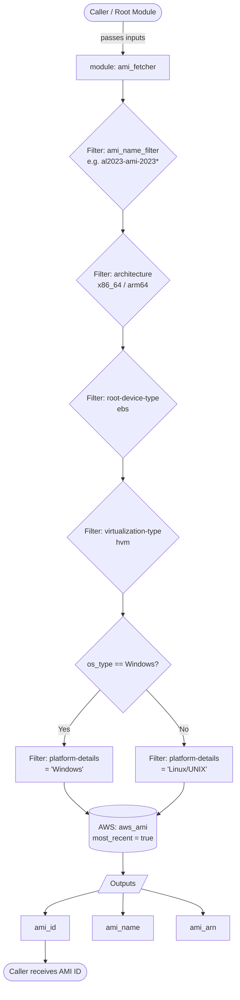

# bk-bake-ami-module

This repository contains Terraform modules used for AMI management in the BakeFoundry ecosystem. It provides a reusable `ami_fetcher` module that queries AWS for the latest matching AMI based on configurable filters.

---

## Repository Structure

```
bk-bake-ami-module/
├── main.tf                        # Root module — calls ami_fetcher
├── variables.tf                   # Root input variables
├── modules/
│   └── ami_fetcher/
│       ├── main.tf                # AWS AMI data source with filters
│       ├── variables.tf           # Module input variables
│       └── outputs.tf             # AMI id, name, arn outputs
```

---

## Flow Diagram



---

## Modules

### `ami_fetcher`

Fetches the latest AMI ID from AWS based on a set of filters. Supports both Linux and Windows AMIs.

#### Input Variables

| Variable | Description | Type | Default | Required |
|---|---|---|---|---|
| `ami_name_filter` | Name glob pattern for the AMI (e.g. `al2023-ami-2023*`) | `string` | — | ✅ Yes |
| `ami_owner` | AWS owner ID or alias (e.g. `amazon`) | `string` | `"amazon"` | No |
| `architecture` | CPU architecture (`x86_64` or `arm64`) | `string` | `"x86_64"` | No |
| `os_type` | Operating system (`Linux` or `Windows`) | `string` | `"Linux"` | No |

#### Outputs

| Output | Description |
|---|---|
| `ami_id` | The ID of the selected AMI |
| `ami_name` | The name of the selected AMI |
| `ami_arn` | The ARN of the selected AMI |

---

## Usage

### Linux AMI (Amazon Linux 2023)

```hcl
module "ami_fetcher" {
  source = "git@github.com:BakeFoundry/bk-bake-ami-module.git//modules/ami_fetcher?ref=v1.0.0"

  ami_name_filter = "al2023-ami-2023*-kernel-6.1-x86_64"
  ami_owner       = "amazon"
  architecture    = "x86_64"
  os_type         = "Linux"
}

output "ami_id" {
  value = module.ami_fetcher.ami_id
}
```

### Windows AMI

```hcl
module "ami_fetcher" {
  source = "git@github.com:BakeFoundry/bk-bake-ami-module.git//modules/ami_fetcher?ref=v1.0.0"

  ami_name_filter = "Windows_Server-2022-English-Full-Base-*"
  ami_owner       = "amazon"
  architecture    = "x86_64"
  os_type         = "Windows"
}

output "ami_id" {
  value = module.ami_fetcher.ami_id
}
```

### Root Module (via `main.tf`)

The root `main.tf` calls the `ami_fetcher` module using root-level variables defined in `variables.tf`:

```hcl
module "ami_fetcher" {
  source = "./modules/ami_fetcher"

  ami_name_filter = var.ami_name
  ami_owner       = var.ami_owner
  architecture    = var.ami_architecture
  os_type         = var.ami_os_type
}
```

---

## Development

### Pre-commit Hooks

This project uses `pre-commit` to ensure code quality.

```bash
pre-commit install
pre-commit run --all-files
```

### Testing

This project uses the native `terraform test` framework.

```bash
terraform test
```