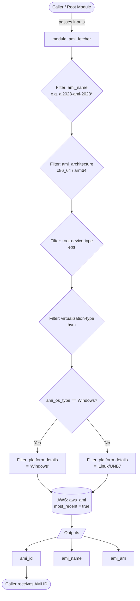

# bk-bake-ami-module

This repository contains Terraform modules used for AMI management in the BakeFoundry ecosystem. It provides a reusable `ami_fetcher` module that queries AWS for the latest matching AMI based on configurable filters.

---

## Repository Structure

```
bk-bake-ami-module/
├── main.tf                        # Root module — calls ami_fetcher
├── variables.tf                   # Root input variables
├── modules/
│   └── ami_fetcher/
│       ├── main.tf                # AWS AMI data source with filters
│       ├── variables.tf           # Module input variables
│       └── outputs.tf             # AMI id, name, arn outputs
```

---

## Flow Diagram



---

## Modules

### `ami_fetcher`

Fetches the latest AMI ID from AWS based on a set of filters. Supports both Linux and Windows AMIs.


## Requirements

| Name | Version |
|------|---------|
| <a name="requirement_terraform"></a> [terraform](#requirement\_terraform) | >= 1.0.0 |
| <a name="requirement_aws"></a> [aws](#requirement\_aws) | >= 5.0 |

## Providers

No providers.

## Modules

| Name | Source | Version |
|------|--------|---------|
| <a name="module_ami_fetcher"></a> [ami\_fetcher](#module\_ami\_fetcher) | ./modules/ami_fetcher | n/a |

## Resources

No resources.

## Inputs

| Name | Description | Type | Default | Required |
|------|-------------|------|---------|:--------:|
| <a name="input_ami_architecture"></a> [ami\_architecture](#input\_ami\_architecture) | The architecture of the AMI (e.g., x86\_64 or arm64) | `string` | `"x86_64"` | no |
| <a name="input_ami_name"></a> [ami\_name](#input\_ami\_name) | The name pattern for the AMI (e.g., al2023-ami-2023*-kernel-6.1-x86\_64) | `string` | n/a | yes |
| <a name="input_ami_os_type"></a> [ami\_os\_type](#input\_ami\_os\_type) | The operating system type (Linux or Windows) | `string` | `"Linux"` | no |
| <a name="input_ami_owner"></a> [ami\_owner](#input\_ami\_owner) | The owner ID or alias for the AMI (e.g., amazon) | `string` | `"amazon"` | no |

## Outputs

No outputs.

No outputs.

---


## Usage

### Linux AMI (Amazon Linux 2023)

```hcl
module "ami_fetcher" {
  source = "git@github.com:BakeFoundry/bk-bake-ami-module.git//modules/ami_fetcher?ref=v1.0.0"

  ami_name         = "al2023-ami-2023*-kernel-6.1-x86_64"
  ami_owner        = "amazon"
  ami_architecture = "x86_64"
  ami_os_type      = "Linux"
}

output "ami_id" {
  value = module.ami_fetcher.ami_id
}
```

### Windows AMI

```hcl
module "ami_fetcher" {
  source = "git@github.com:BakeFoundry/bk-bake-ami-module.git//modules/ami_fetcher?ref=v1.0.0"

  ami_name         = "Windows_Server-2022-English-Full-Base-*"
  ami_owner        = "amazon"
  ami_architecture = "x86_64"
  ami_os_type      = "Windows"
}

output "ami_id" {
  value = module.ami_fetcher.ami_id
}
```

### Root Module (via `main.tf`)

The root `main.tf` calls the `ami_fetcher` module using root-level variables defined in `variables.tf`:

```hcl
module "ami_fetcher" {
  source = "./modules/ami_fetcher"

  ami_name         = var.ami_name
  ami_owner        = var.ami_owner
  ami_architecture = var.ami_architecture
  ami_os_type      = var.ami_os_type
}
```

---

## Development

### Pre-commit Hooks

This project uses `pre-commit` to ensure code quality, formatting (`terraform fmt`), and security scanning (`checkov`).

**Prerequisites:** Docker must be running locally, as the hooks execute inside isolated containers.

```bash
pre-commit install
pre-commit run --all-files
```

### Testing

This project uses the native `terraform test` framework.

```bash
terraform test
```
